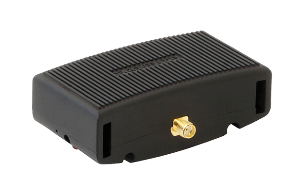

# 🔬 USB Hacking – Aaronia BPSG 6 Signal Generator

# Projet Ultra Complet

Bienvenue sur le projet ultra complet, conçu pour tester toutes les fonctionnalités de l'import automatique de portfolio.

<!--portfolio
{
  "id": "ultracomplet",
  "repo": "https://github.com/bosco-drg/ultra-complet",
  "date": "2024-07-01",
  "images": [
    "https://raw.githubusercontent.com/bosco-drg/Reverse-Engineering/main/docs/img/generator_aaronia.png",
    "https://raw.githubusercontent.com/bosco-drg/Reverse-Engineering/main/docs/img/generator_aaronia.png",
    "https://raw.githubusercontent.com/bosco-drg/Reverse-Engineering/main/docs/img/generator_aaronia.png",
    "https://raw.githubusercontent.com/bosco-drg/Reverse-Engineering/main/docs/img/generator_aaronia.png"
  ],
  "tags": [
    "python", "iot", "hardware", "web", "ai", "robotics", "opensource", "cloud", "devops", "security"
  ],
  "title_fr": "Projet Ultra Complet",
  "title_en": "Ultra Complete Project",
  "short_desc_fr": "Un projet de test exhaustif pour explorer toutes les possibilités du script d'import.",
  "short_desc_en": "An exhaustive test project to explore all import script possibilities.",
  "desc_fr": "Ce projet ultra complet démontre l'intégration de toutes les fonctionnalités prévues pour le portfolio automatisé. Il inclut des images, des sections variées, des liens, des listes, du code, des tableaux, et des captions multilingues. Il permet de valider la robustesse du script sur de grands volumes de données et de textes.",
  "desc_en": "This ultra complete project demonstrates the integration of all features planned for the automated portfolio. It includes images, various sections, links, lists, code, tables, and multilingual captions. It validates the script's robustness on large volumes of data and text.",
  "img_caption_fr": "Image illustrative du projet ultra complet.",
  "img_caption_en": "Illustrative image of the ultra complete project.",
  "img_caption1_fr": "Première image du projet, montrant l'interface principale.",
  "img_caption1_en": "First project image, showing the main interface.",
  "img_caption2_fr": "Deuxième image, démonstration de la fonctionnalité avancée.",
  "img_caption2_en": "Second image, advanced feature demonstration.",
  "img_caption3_fr": "Troisième image, visualisation des résultats.",
  "img_caption3_en": "Third image, results visualization.",
  "img_caption4_fr": "Quatrième image, schéma SVG du système.",
  "img_caption4_en": "Fourth image, SVG diagram of the system.",
  "long_text_fr": "Voici un très long texte en français. Voici un très long texte en français. Voici un très long texte en français. Voici un très long texte en français. Voici un très long texte en français. Voici un très long texte en français. Voici un très long texte en français. Voici un très long texte en français. Voici un très long texte en français. Voici un très long texte en français. Fin du texte.",
  "long_text_en": "Here is a very long text in English. Here is a very long text in English. Here is a very long text in English. Here is a very long text in English. Here is a very long text in English. Here is a very long text in English. Here is a very long text in English. Here is a very long text in English. Here is a very long text in English. Here is a very long text in English. End of text.",
  "sections": [
    {
      "type": "text",
      "value": [
        "project_ultracomplet_desc",
        "long_text_fr"
      ]
    },
    {
      "type": "image",
      "src": "https://raw.githubusercontent.com/bosco-drg/Reverse-Engineering/main/docs/img/generator_aaronia.png",
      "caption_i18n": "img_caption1_fr"
    },
    {
      "type": "image",
      "src": "https://raw.githubusercontent.com/bosco-drg/Reverse-Engineering/main/docs/img/generator_aaronia.png",
      "caption_i18n": "img_caption2_fr"
    },
    {
      "type": "image",
      "src": "https://raw.githubusercontent.com/bosco-drg/Reverse-Engineering/main/docs/img/generator_aaronia.png",
      "caption_i18n": "img_caption3_fr"
    },
    {
      "type": "image",
      "src": "https://raw.githubusercontent.com/bosco-drg/Reverse-Engineering/main/docs/img/generator_aaronia.png",
      "caption_i18n": "img_caption4_fr"
    },
    {
      "type": "hr"
    },
    {
      "type": "text",
      "value": [
        "Voici une section supplémentaire pour tester l'empilement de textes.",
        "On peut ajouter plusieurs paragraphes ici.",
        "Liste des fonctionnalités :",
        "- Import automatique",
        "- Gestion multilingue",
        "- Téléchargement d'images",
        "- Sections variées (texte, image, lien, code, tableau, hr)",
        "- Robustesse sur de gros volumes"
      ]
    },
    {
      "type": "list",
      "items": [
        "Premier point de la liste",
        "Deuxième point",
        "Troisième point"
      ]
    },
    {
      "type": "code",
      "language": "python",
      "value": [
        "def hello_world():",
        "    print('Hello, world!')"
      ]
    },
    {
      "type": "table",
      "headers": ["Fonctionnalité", "Statut"],
      "rows": [
        ["Import README", "OK"],
        ["Téléchargement images", "OK"],
        ["Traductions", "OK"],
        ["Sections complexes", "OK"]
      ]
    },
    {
      "type": "link",
      "href": "https://github.com/bosco-drg/ultra-complet",
      "caption_i18n": "project_ultracomplet_link_caption",
      "target": "_blank"
    },
    {
      "type": "hr"
    },
    {
      "type": "text",
      "value": [
        "Encore un peu de texte pour tester la longueur du contenu. Encore un peu de texte pour tester la longueur du contenu. Encore un peu de texte pour tester la longueur du contenu. Encore un peu de texte pour tester la longueur du contenu. Encore un peu de texte pour tester la longueur du contenu. Encore un peu de texte pour tester la longueur du contenu. Encore un peu de texte pour tester la longueur du contenu. Encore un peu de texte pour tester la longueur du contenu. Encore un peu de texte pour tester la longueur du contenu. Encore un peu de texte pour tester la longueur du contenu. "
      ]
    }
  ]
}
-->

  

Ce projet vise à rétroconcevoir le protocole de communication USB utilisé par le générateur de signaux RF Aaronia BPSG 6. Le fabricant ne fournit aucune documentation API, et le logiciel officiel n'est disponible que pour les plateformes x86 avec une interface graphique, ce qui le rend inutilisable sur des systèmes sans écran comme le Raspberry Pi.  
Notre objectif est de créer un outil open-source en ligne de commande (Python) pour contrôler les fonctions de base du générateur (fréquence, puissance de sortie) via USB, le rendant ainsi accessible pour des applications embarquées ou à distance.

---

## 🚀 Objectifs

- Comprendre le protocole USB utilisé par le BPSG 6
- Capturer et analyser les paquets USB du logiciel propriétaire
- Développer une interface Python multiplateforme pour piloter le générateur
- Permettre l'utilisation sur des systèmes headless ou ARM (ex : Raspberry Pi)

## 🔧 Outils utilisés

- `Wireshark`
- `usbmon`
- `PyUSB`
- `lsusb`
- `dmesg`

---

> Ce projet est à but éducatif et n'est pas affilié à Aaronia AG.
